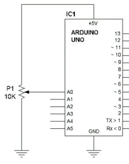
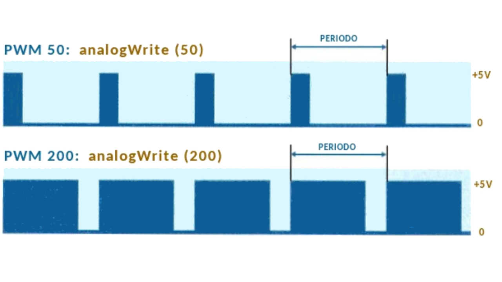
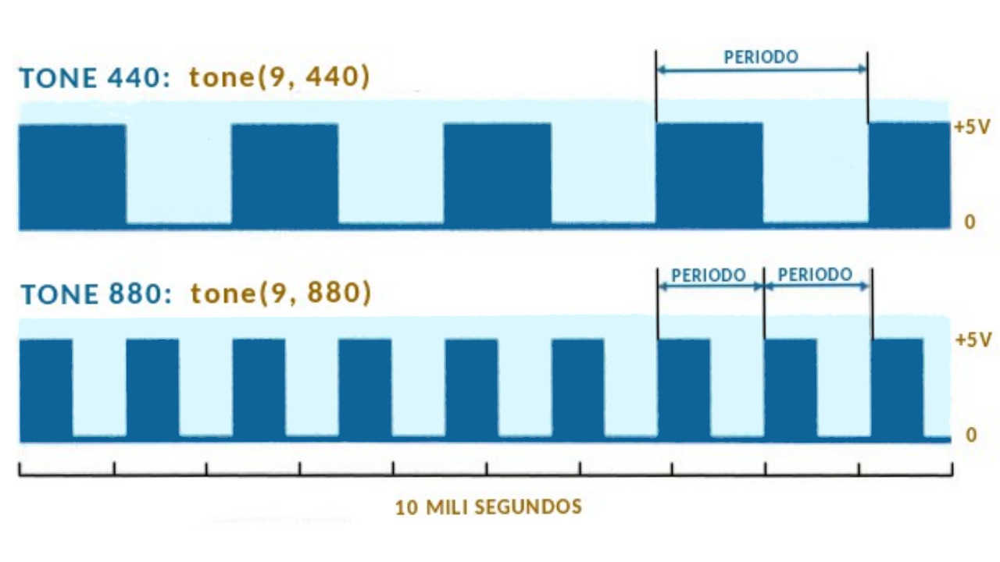
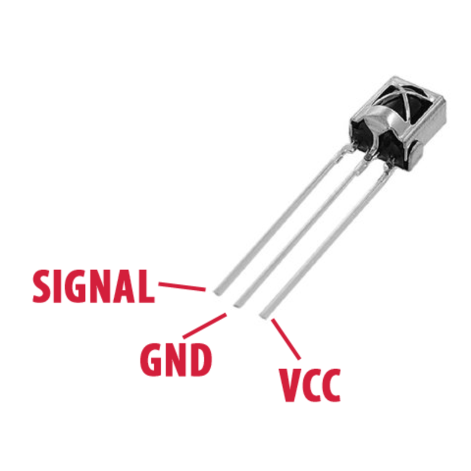

El material de curso lo puedes encontrar en [github.com/MaraniMatias/curso-Arduino](https://goo.gl/VKMCUF)

# Variables
Las variables nos permiten guardar algún tipo de dato, para luego usarlo o manipularlo, algunos de los  tipos de variables mas usados.

## Int

Usada para guardar numero enteros positivos o negativos.

| Tipo                | Rango que puede guardar   |
|:-------------------:|:-------------------------:|
| int                 | -32768 a 32767            |
| unsigned int        | 0 a 65535                 |
| signed int          | -32768 a 32767            |
| short int           | -128 a 127                |
| unsigned short int  | 0 a 255                   |
| signed short int    | -128 a 127                |
| long int            | -2147483648 a 2147483647  |
| signed long int     | -2147483648 a 2147483647  |
| unsigned long int   | 0 a 4294967296            |

```c++
int entero = 200;
short int entero_corto = 25;
// Se puede hacer cualquier operación matemática básica.
int suma = entero + entero_corto;
```

## Char

Un char es cualquier carácter (a,Q,4,#,\).
Para Arduino es un numero que representa un carácter según la tabla ASCII [asciitable.com](http://www.asciitable.com)

| Tipo          | Rango que puede guardar  |
|:-------------:|:------------------------:|
| char          | -128 a 127               |
| unsigned char | 0 a 255                  |
| signed char   | -128 a 127               |

```c++
char a = 'a'; // Representa a
char A = 65;  // Representa A
// Como char es un int podemos hacerle operaciones matemáticas.
// A - 1 al se enteros 65 - 1 = 64 y 64 es @ para una variable char.
char arroba = A - 1;
// caracteres especiales
char enter='\n';
char tab='\t';
```

## Float y  Double

Esto dos tipo de variables nos permiten guardar números decimales, la diferencia esta en la presión.

| Tipo        | Rango que puede guardar |
|:-----------:|:-----------------------:|
|   float     |\`3.4E^{-38}\` a \`3.4E^{+38}\`|
|   double    |\`1.7E^{-308}\` a \`1.7E^{+308}\`  |
| long double |\`3.4E^{-4932}\` a \`3.4E^{+4932}\`|

```c++
float  f = 26.165; // Las comas son puntos
double d = 1256.05854;
```

## Boolean o Bool

Solo puede tomar dos valores Verdadero o Falso

| Verdadero | Falso |
|:---------:|:-----:|
|    true   | false |
|     1     |   0   |

```c++
  boolean verdadero = true, falso = false;
  boolean rta;

  rta = verdadero && falso;     // 'rta' -> false.
  rta = falso     && falso;     // 'rta' -> false.
  rta = verdadero && 1;         // 'rta' -> true.
  rta = verdadero && true;      // 'rta' -> true.

  rta = verdadero || falso;     // 'rta' -> true.
  rta = falso     || falso;     // 'rta' -> false.
  rta = verdadero || verdadero; // 'rta' -> true.
  rta = verdadero || true;      // 'rta' -> true.

  rta = verdadero == true;      // 'rta' -> true.
  rta = verdadero != false;     // 'rta' -> true.

  int x = 5, y = 10;
  rta = x == 10; // 'rta' -> false, el valor de 'x' no es igual a 10.
  rta = x == 5;  // 'rta' -> true.
  rta = x != 5;  // 'rta' -> false, el valor de 'x' es 5 y no es distinto (!=) de 5.
  rta = x != 10; // 'rta' -> true.

  rta = 5 < 10;   // 'rta' -> true.
  rta = 5 >= 10/2;// 'rta' -> true, primero hacer la operación matemática y después compara.

  rta = (x >= 10 && x <= 20) // Es true cuando x está entre 10 y 20
```

En el ejemplo anterior usamos operadores lógicos, `&&` (AND), `||` (OR), `!` (NOT), también comparadores `==` (igualdad), `!=` (distinto), `> < <= >=` mayor, menor, mayor igual, menor igual.

## Ámbito
```c++
int a = 0;    // Es una variable Global, puede ser usada en todo el programa.
void setup() {
  int b = 0;  // Es una variables Local.
  a++;        // a = a + 1, entonces a  vale 1
  b--;        // b = b - 1, entonces b vale -1
}
void loop() {
  a = a + 5;  // a vale 6
  b = a + 3;  // ERROR b no esta declarada en la función loop.
}
```

## Constantes
Son modificadores de variables que indican que esa variable no cambia su valor, permite ahorrar memoria
```c++
#define NOTE_B0  31     // NOTE_B0 es una constante.

const int LED_PIN = 13; // Como el número de pin no cambia durante el programa.
const int BTN_PIN = 0;

void setup() {
  pinMode(LED_PIN, OUTPUT);
  pinMode(BTN_PIN, INPUT);
}
```

## Conversion automática

```c++
int a = 50;
float f;
a = a + 1.5;  // como a es int su valor es 51
f = a + 1.5;  // como f es float su valor es 51.05
a = f;        // como a es int su valor es 51
f = a;        // como f es float su valores es 51.00
```

## NULL
Cunado una variables es declara pero no se le asigna valor, tiene un valor nulo, NULL.
```c++
int n;             // el valor de 'n' es NULL
boolean rta;       // el valor de 'rta' es NULL

rta = (n == NULL); // el valor de 'rta' es true
```

## Asignación entre variables
```c++
short int a = 10;
short int b;

b = a;  // Ahora b contiene lo que contiene a
a = 50; // en este momento a y b contiene el valor 50
b = 5;  // Desde ahora b contiene el valor 5, ahora es independente de a.
```

## String
Es incorporada por Arduino para manejar cadenas de caracteres, oraciones, palabras.
La palabra _String_ hace referencia a una clase, permite hacer más cosas que una variable.
Más información [www.arduino.cc/en/Reference/StringObject](https://www.arduino.cc/en/Reference/StringObject)

```c++
String oracion = "Hola";
oracion = oracion + " Mundo";   // oración contiene "Hola Mundo"

oracion.concat(":D");           // oración contiene "Hola Mundo :D"
oracion.replace('o', '0');      // oración contiene "H0la Mund0 :D"
```

# Señales

## Digital
Para leer o escribir una señal digital

```c++
void setup() {
  pinMode(13, OUTPUT);
  pinMode(0, INPUT);

  digitalWrite(13, HIGH);   // Enviamos un pulso alto al pin 13
  delay(500);
  digitalWrite(13, LOW);    // Enviamos un pulso bajo al pin 13
}
void loop() {
  int val = digitalRead(0); // Permite leer el pin 0, puede ser HIGH o LOW
  digitalWrite(13, val);
}
```
Los términos `HIGH` y `LOW` son constantes globales y su valor son `1` y `0` respectivamente.

## Analógicas
Las señales analógicas varían su valor con el tiempo de forma continua, por esa razón Arduino solo puede leer con los pines que lleva un `A` como ser `A0`, `A5` y no podemos emitir señales analógicas.

Con señales digitales tenemos valores `1` o `0` pero con las analógicas tenemos valores que varía desde `0` a `1023`, con un valor `0` el pin recibe `0 volt` y con un valor `1023` el pin recibe `5 volt` (limite de tension que puede manejar Arduino).

```c++
const int POTENCIOMETRO_PIN= A0;
const int LDR_PIN = A1;

void setup() {
  pinMode(POTENCIOMETRO_PIN, INPUT);
  pinMode(LDR_PIN, INPUT);
}

void loop() {
  // valorPote des 0 a 1023 según en que poción ese encuentra
  int valorPote = analogRead(POTENCIOMETRO_PIN);
  // valorLDR des 0 a 1023 según cuanta luz recibe.
  int valorLDR  = analogRead(LDR_PIN);
}
```
La conexión la LDR es la misma que para un botón.

Conexión para un potenciómetro.



### Pines que permite modular el ancho de pulso (PWM)
Como Arduino no puede variar los niveles de tension de sus pines, podemos simular señales analógicas, variando la longitud del pulso, de esta manera reducimos la tension promedio que llega a un LED, por ejemplo.

Los pines PWM esta marcados con `~` como los pines 3,5,6,9,10,11,13.
La función que usaremos es `analogWrite(pin,valor)` conde `pin` es el numero de pin a usar y `valor` puede variar d e 0 a 255.

La imagen ayuda a entender que hace la función.



```C++
void setup() {
  pinMode(11, OUTPUT);
}

void loop() {
  analogWrite(11, 0);     // LED apagado
  delay(200);
  analogWrite(11, 125);   // LED prendido con la mitad de su brillo
  delay(200);
  analogWrite(11, 255);   // LED prendido con el maximo de su brillo
}
```

Con la función `tone(pin, frecuencia, duración)` podemos variar la frecuencia del pulso, normalmente usada para con piezo buzzer.

Donde `frecuencia` puede variar 31 a 65535 (para Arduino Uno, Mega, Leonardo), `duracion` es el tiempo en que va a mantenerse esa frecuencia.

Para usar varios pines necesitamos `noTone(pin)` para apagar los pines anteriores.



Ejemplo en [arduino.cc/en/Tutorial/ToneMelody](https://www.arduino.cc/en/Tutorial/ToneMelody)

> También puedes ver los ejemplo
> `_06-pin-PWM`
> `_07a-buzer-LDR-PWM`
> `_07b-buzer-tone`
> junto a los apuntes del curso.

# Comunicación por medio del puerto serie (USB).

Arduino puede recibir ordenes por el puerto serie y escribir en él, enviar información.

Podemos ver y escribir en el puerto con el monitor serie del IDE de Arduino, click en Herramientas -> Monitor serie.

```c++
void setup() {
  // Para establecer a que velocidad serán enviado los datos.
  Serial.begin(9600); // 9600 es el valor predeterminado
}

void loop() {
  // Escribe en el puerto serie "HOLA "
  Serial.print("HOLA ");
  // Escribe en el puerto serie "MUNDO" y baja una linea
  Serial.println("MUNDO");
  delay(500);
}
```
```c++
void loop() {
  char value = 0;
  if (Serial.available() > 0) { // Si recibimos alguna señal
    value = Serial.read();      // lee el puerto
    Serial.print("Msj: ");
    Serial.println(value);      // escribe en el puerto
  }
}
```
> También puedes ver los ejemplo
> `_08-serial-port`
> `_09-serial-port-leer`
> `_19-serial-voltaje`
> junto a los apuntes del curso.

# Bloques de decisión
## If-else
```c++
bool condicion = true;
// El if dentro de los paréntesis necesita una condición cuyo valor es 'true' o 'false'
if ( condicion ) {
  // en caso de que 'condición' tenga un resultado true
} else {
  // en caso de que 'condición' tenga un resultado false
}

int a = 5, b = 10;
if (a > b) {
  // en caso de 'a' es mayor que 'b'
} else if (a == 2) {
  // en caso de que 'a' es menor a 'b' y 'a' es igual a '2'
} else {
  // en caso de que no se cumpla ninguna de las anteriores
}
```
> También puedes ver los ejemplo
> `_02-if-elseif-else`
> `_03-btn-ej-logicos`
> junto a los apuntes del curso.

Forma corta del if else, solo se puede usar si existe camino por el verdadero y el falso, con una sola sentencia.
```c++
int puntos, String nota = "";
// Cuando puntos sea mayor igual a 6
// la variable notas contiene "Aprobado" de lo contrario "Desaprobado"
nota = puntos >= 6 ? "Aprobado" : "Desaprobado";

// remplaza al escribir
if (puntos >= 6 ?) {
  nota = "Aprobado";
} else {
  nota = "Desaprobado";
}
```

## Switch

```c++
char a = 'a';

switch (a) {
  case 'a':
    // código a ejecutar cuando a es igual a 'a'
    break;
  case 'b':
    // código a ejecutar cuando a es igual a 'b'
    break;
  case 'c':
  case 'd':
    // código a ejecutar cuando a es igual a 'c' o a 'd'
    break;
  default:
    // código a ejecutar cuando a NO es igual a 'a' ni a 'b' ni a 'c' ni a 'd'
    break;
}
```

> También puedes ver los ejemplo
> _04-display-switch-case
> junto a los apuntes del curso.

# Bucles
## While y Do While
```c++
long int i = 0;

while ( i < 150000 ) {
  // Mientras i sea menor a 1500000
  digitalWrite( pinLED, HIGH);
  i++;
}
digitalWrite( pinLED, LOW);

do {
  // Hacer una vez y después evaluar la condición
  digitalWrite( pinLED, HIGH);
  delay(500);
} while ( i < 150000);
digitalWrite( pinLED, LOW);
```
## For
La sentencia for tiene tres parámetros, inicialización, condición, incremento.
* Inicialización `int i = 0`, se lo primero a ejecutarse y una única vez.
* Condición `i <= 3`, mientras la condición de un resultado `true` entra al código entre llaves `{...}`.
* Incremento `i++`, después de terminar con las sentencias entre llaves ejecuta la sentencia incremento.

```c++
for (int i = 0 ; i <= 3; i++ ) {
  Serial.println(i); // Muestra por el puesto serie el valor de i
}
/*
Resultado en puerto serie
  0
  1
  2
  3
*/
```
Este código trabaja de la siguiente manera, primero se inicializa la variable i con valor 0, luego se evalúa la condición si se cumple ejecuta el código entre llaves, después incrementa i y vuelve a probar la condición si se cumple vuelve a ejecutar el código entre llaves al terminal incrementa i, asi sucesivamente hasta que la condición no se cumpla.

# Arreglos
Imaginemos que tenemos que guardar la castidad de habitantes de 7 casas.

Podemos crear 7 variables enteras una para cada casa, pero no seria cómodo ni lógico, para esto casa usamos los arreglos (array).

__Arreglos de enteros__
```c++
// Con los [] indicamos que es un arreglo y con {} para inicializar su valores
int casas[] = { 4, 5, 2, 3, 4, 2, 1 };

casas[0]; // para obtener los habitantes de la casa 0, en este caso 4
casas[6]; // para obtener los habitantes de la casa 6, en este caso 1

int indice = 0;
casas[indice]; // para obtener los habitantes de la casa 0, en este caso 4
```

__Arreglos de caracteres__
```c++
char palabra[] = {'H', 'o', 'l', 'a'};
char stringArd[] = "arduino";

palabra[0] = 'h';         // en el lugar 0 del arreglo palabras guardamos h
Serial.println(palabra);  // hola
```

> También puedes ver los ejemplo
> `_10-array`
> `_11-for`
> junto a los apuntes del curso.

# Funciones
Las funciones los permite hacer que nuestro código sea reutilizable y modular.

La función `loop()` es una de las que mas usamos, cuando las funciones no devuelve valore se agreda `void` en su declaración `void loop()`

```c++
const int pinLEDs[] = {8, 10, 12};

// Declaración de la función loop
void loop() {
  delay(500); // Llamada ala función delay
  ledOff();   // Llamada ala función ledOff
  delay(500);
  ledOn();    // Llamada ala función ledOn
}

// Declaración de la función ledOff
void ledOff () {
  digitalWrite( pinLEDs[0], LOW);
  digitalWrite( pinLEDs[1], LOW);
  digitalWrite( pinLEDs[2], LOW);
}

// Declaración de la función ledOn
void ledON () {
  digitalWrite( pinLEDs[0], HIGH);
  digitalWrite( pinLEDs[1], HIGH);
  digitalWrite( pinLEDs[2], HIGH);
}
```

Ahora queremos enviar información a nuestra función, para eso lo hacemos por medio de parámetros, que indicamos dentro de los paréntesis cuando declaramos una función y tenemos que indicar de que tipo son los valores que recibe nuestra función.
```c++
// nuestra función nos permite sumar dos numero y mostrarlos.
void sumaMostrar(int a, int b) {
  Serial.println(a+b);
}
```
Ahora queremos que nuestra función devuelva el resulta de la suma, para eso en lugar de `void` tenemos que indicar el tipo de valor a devolver.
```c++
// nuestra función nos permite sumar dos numero y retorna el resultado.
int suma(int a, int b) {
  return a + b;
}
```
Ahora podemos re-escribir la función sumaMustra
```c++
void loop() {
  int a = 5, b = 5;
  sumaMostrar(a,b);
}
void sumaMostrar(int a, int b) {
  int rta = suma(a,b);
  Serial.println( rta );
}
int suma(int a, int b) {
  return a + b;
}
```
Usamos siempre `a` y `b` pero no son variables distintas para cada función.

## Funciones en distintos archivos
Arduino IDE nos permite crear varios archivos `.ino` en la carpeta de nuestro proyecto, de esta manera podemos tener el programa principal (setup y loop) en el archivo con igual nombre que la carpeta y otros archivos que contengan las funciones secundarias de nuestro programa.

## Variables estáticas
La palabra clave `static` se utiliza para crear variables que son visibles para una sola función. sin embargo, a diferencia de las variables locales que se crean y destruyen cada vez que se llama a una función, las variables estáticas persisten más allá de la llamada a la función, preservando sus datos entre las llamadas de función.

# Librerías
Se usan para encapsular código y usar código de terceros.

## De sistema
Si bien Arduino proporciona muchas funciones matemáticas puede ser que necesito otras que esta incluidas en la librería `math.h`
```c++
// Contiene funciones como `round`, `floor`, `trunc`
#include <math.h>

double result;
result = round( 2.3);  // 2.0
result = floor( 5.5);  // 5.0
result = trunc(-3.8);  // -3.0
```

## De terceros

Para manejar un control remoto, con infrarrojo usaremos las librerías que podemos descargar de [github.com/z3t0/Arduino-IRremote](https://github.com/z3t0/Arduino-IRremote) o de [IRremote.zip](https://github.com/MaraniMatias/curso-Arduino/blob/master/datasheet/librerias/IRremote.zip?raw=true).

> Nota: también incluí la librería para manejar el sensor de ultrasonido. [sensor-infrarrojo.png](https://github.com/MaraniMatias/curso-Arduino/blob/master/datasheet/librerias/Ultrasonic%20Sensor%20SR04.zip?raw=true)

Para que Arduino IDE reconozca un librería de tercero primero hay que importarla, después estará disponible para cualquier proyecto.

Pasos a seguir:
1. Descargar la librería en formato zip.
2. En Arduino IDE ir la menu __Programa__ luego __Incluir Librería__ después __Añadir Librería__
3. Buscar donde descargamos el archivo ZIP y pulsar aceptar.

```c++
// Importamos la librería a usar
#include <IRremote.h>
#include <IRremoteInt.h>

int RECV_PIN = 11;
int STATUS_PIN = 13;

// la librería nos pide incluir esta lineas
IRrecv irrecv(RECV_PIN);
decode_results results;

void setup() {
  pinMode(STATUS_PIN,OUTPUT);
  Serial.begin(9600);
  irrecv.enableIRIn();
}

void loop() {
  if (irrecv.decode(&results))    {
    Serial.println(results.value);
    // Viendo los valores de `results.value` podemos ver el código del botón que presionamos.
    if (results.value == 1477816464) { // cuando es el botón con código 1477816464
      digitalWrite(STATUS_PIN,HIGH);
    }
    if (results.value ==  374608567) { // cuando es el botón con código 374608567
      digitalWrite(STATUS_PIN,LOW);
    }
    irrecv.resume();
  }
}
```
El sensor infrarrojo que usamos es _VS1838B_, con tres pin, 1º Señal, 2º tierra y el 3º 5 volt.
En la carpeta datasheet hay más información, para este sensor conviene buscar cual es cada pin.



> También puedes ver los ejemplo
> `_14a-control-inf`
> `_18-debounce`
> junto a los apuntes del curso.

# Integrados

Los integrados es un componente electrónico que contiene un circuito en el interior.
El integrado L293D nos permite manejar dos motores de corriente continua y invertir su giro o manejar un motor paso a paso.

La imagen muestra para que son cada pin del integrado.
* Los pines `4,5,13,12` se conectan directamente a tierra.
* En el pin `8` este pin recibe la tension correspondiente a lo que se desea manejar, motores 12 volt. LED 5 o 3 volts.
* En el pin `16` se conectan a los 5 volt. de la placa Arduino.
* Los pines `2,7,15,10` cuando estos pines reciben tensión, un pulso positivo, el integrado entrega tension en los pines `3,6,14,11` según corresponda, para el pin `2` corresponde ala salida `3`.
* Los pines `1,9` habilita o deshabilitan la salida de los pines de ese lado del integrado.


Con este integrado podemos manejar motores eléctricos, solo hay que avisarle al integrado que salida queremos activar, para ello tenemos que darle un pulso *HIGH* de manera igual que encender un led, y gracias ala configuración que tiene el integrado dará la tension que necesita el motor, *por ejemplo, si el pin 2 recibe un pulso HIGH el integrado se encarga de dar un pulso HIGH al pin 3*.
**Algo importante** hay que tener cuidado cuando trabajamos con con motores, imaginemos tener conectado el motor en conectado en los pines 3 y 6, cuando llega un pulso `HIGH` al pin 2 y un pulso `LOW`, el integrado entrega tension al pin 3 ahora si por error damos un pulso `HIGH` a los pines 2 y 7 el integrado entrega tension a los pines 3 y 6 ala vez de esta manera la bobina del motor recibe tension por su dos extremos provocando que se **queme**.
Por ese motivo para aprender a usar este integrado recomiendo probar con LEDs y la tension que corresponde para ellos, antes de usar motores.

En la carpeta datasheet hay más información para el integrado L293D.

## Circuitos

Con dos motores de corriente continua, esta conexión permite invertir el giro de cada motor.


> También puedes ver los ejemplo
> `_17-puente-h-l293d`
> junto a los apuntes del curso.

Conexión para un motor paso a paso bipolar.


> También puedes ver los ejemplo
> `_16-l293d-motor-paso-a-paso-bipolar`
> `_16-l293d-motor-paso-a-paso-4-bobinas`
> junto a los apuntes del curso.

