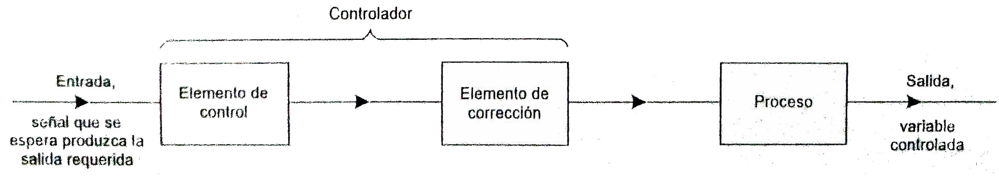

<!--.slide: data-background-color="#740"-->
# Introducción

## Mecanización

El usuario pasa a controlar o programar una máquina que hace el trabajo.

Por ejemplo, ascensor de carga.

## Automatización

Cuando la máquina pueda trabajar sin necesidad de un control permanente por parte del usuario.

Por ejemplo, escaleras mecánicas.

## Robotización

Sustituir el trabajo manual del hombre y el intelectual mediante una máquina "inteligente" que es capaz de hacer una labor repetitiva y tomar decisiones.

### Sistema de Control

Los automatismos y los robots son capaces de iniciar y detener procesos sin intervención manual.

Recibir información del exterior, la procesan y emitir una respuesta.

* En un automatismo dicha respuesta será siempre la misma.
* En un robot podemos tener diferentes respuestas según las circunstancias, **Sistema de control**.

A la información que recibe el sistema del exterior se le denomina **entrada**.

A la condición que aparece en el exterior después de la actuación (o no actuación) se denomina **salida**.

<!-- .slide: data-background="#fff" -->
#### Sistemas de Lazo Abierto

#### Sistemas de Lazo Cerrados

<!--.slide: data-background-color="#740"-->
# Sensores && Actuadores

## Sensores

El sensor traduce la información que le llega del exterior en un impulso eléctrico.

Pueden ser Digitales o Analógicos.

**Tipos de Sensores**

- De contacto.
- Ópticos.
- Térmicos.
- De humedad.
- Magnéticos.
- Infrarrojos.
- Proximidad.
- Ultrasónico.

## Actuadores

Son los elementos que influyen directamente en la señal de salida del automatismo, modificando su magnitud según las instrucciones que reciben de la unidad de control.

Pueden ser Neumáticos, Hidráulicos, Eléctricos, Digitales o Analógicos.

**Tipos de Actuadores**

- Electrónicos
- Hidráulicos
- Neumáticos
- Eléctricos

<!--.slide: data-background-color="#740"-->
# Domótica
